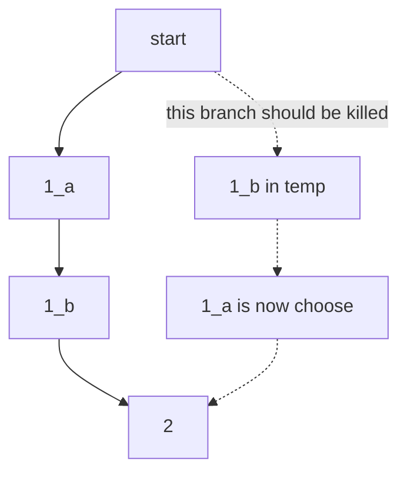
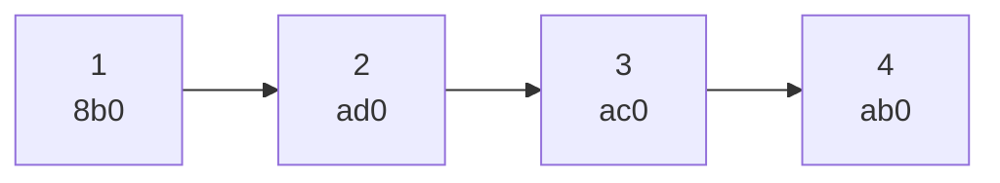

### 402 移动K位数字
官方题解写的，假如 1432 删掉 1 位，假如删除 1/4，肯定是删除 4更好，也就是说 $d_1d_2d_id_k \ and \  d_k>d_i$ 删除dk更好 

那么可以重复k次，这样又太慢了

单调栈（单调不减 1223），什么时候删除栈顶：有更小的（隐含栈不空且还有删除次数）

```py
class Solution:
    def removeKdigits(self, num: str, k: int) -> str:
        numStack = []

        # 构建单调递增的数字串
        for digit in num:
            while k and numStack and numStack[-1] > digit:
                numStack.pop()
                k -= 1

            numStack.append(digit)

        # 如果 K > 0，删除末尾的 K 个字符
        finalStack = numStack[:-k] if k else numStack

        # 抹去前导零
        return "".join(finalStack).lstrip('0') or "0"
```


### 47 全排列
难点在于剪枝条件

```java
import java.util.ArrayList;
import java.util.Arrays;
import java.util.List;

class Solution {
    public List<List<Integer>> permuteUnique(int[] nums) {
        Arrays.sort(nums);
        used = new boolean[nums.length];
        List<Integer> temp = new ArrayList<>(nums.length);
        anw = new ArrayList<>();
        help(temp, nums, 0);
        return anw;
    }

    private List<List<Integer>> anw;
    boolean[] used;

    private void help(List<Integer> temp, int[] nums, int posi) {
        if (posi == nums.length) {
            anw.add(new ArrayList<>(temp));
            return;
        }
        for (int i = 0; i < nums.length; i++) {
            if (i > 0 && nums[i] == nums[i - 1] && used[i - 1]) continue;
            if (!used[i]) {
                used[i] = true;
                temp.add(nums[i]);
                help(temp, nums, posi + 1);
                temp.remove(temp.size() - 1);
                used[i] = false;
            }
        }
    }
}
```



[参考](https://leetcode.cn/problems/permutations-ii/solutions/9917/hui-su-suan-fa-python-dai-ma-java-dai-ma-by-liwe-2/)

另外一个题，给定一个数字 target，和限定数字个数 useNum，要求：从 [1, target] 找 useNum 个数字，和为 target

先写一个全排列，然后改进，一是剪枝，二是选数字没必要用 `used[]` 标记

```java
import java.util.ArrayList;
import java.util.List;

class Solution {
    public List<List<Integer>> solve(int target, int maxUse) {
        this.maxUse = maxUse;
        anw = new ArrayList<>();
        ArrayList<Integer> temp = new ArrayList<>();
        dfs(temp, 0, target);
        return anw;
    }

    private void dfs(List<Integer> temp, int sum, int target) {
        if (sum > target || temp.size() > maxUse) {
            return;
        } else if (sum == target) {
            anw.add(new ArrayList<>(temp));
            return;
        }
        for (int i = 1; i <= target; i++) {
            if (!temp.isEmpty() && i <= temp.getLast()) {
                continue;
            }

            temp.add(i);
            dfs(temp, sum + i, target);
            temp.remove(temp.size() - 1);
        }
    }

    List<List<Integer>> anw;
    int maxUse;

    public static void main(String[] args) {
        Solution solution = new Solution();
        List<List<Integer>> anw = solution.solve(10, 3);
        for (List<Integer> l : anw) {
            for (Integer i : l) {
                System.out.print(i.toString() + ' ');
            }
            System.out.println();
        }
    }
}
```


### 删除链表



直接访问数字值的删除就会出现头节点和中间节点的区别，但是用指针还有另一种方法 [来源](https://www.bilibili.com/video/BV1XX9dYHEjb/?share_source=copy_web&vd_source=2243461ea5436797acfccf909bc5f6be&t=939)

```cpp
#include <iostream>

using namespace std;


struct listNode {
    listNode(int i) {
        val = i;
    }

    int val;
    listNode *next = nullptr;
};

void printNode(listNode *head) {
    cout<<"\nbegin print\n";
    listNode *walk = head;
    while (walk) {
        cout << walk->val << " address is " << walk<<endl;
        walk = walk->next;
    }
}


listNode *head = nullptr;

void remove_list__entry(listNode *entry) {

    listNode **indirect = &head;

    while ((*indirect) != entry) {
        indirect = &((*indirect)->next);
    }
// 第一次循环：
// *indirect 是 head，即 l1 的地址。
// 因为 *indirect != &l2，进入循环体。
// indirect 更新为 &(l1->next)（即 l1 的 next 指针的地址）。
// 第二次循环：
// *indirect 是 l1->next，即 l2 的地址。
// 此时 *indirect == &l2，循环终止。
    *indirect = entry->next;
// indirect 指向的是 l1->next 的地址。
// 修改 *indirect 等于将 l1->next 的值从 &l2 改为 l2->next（即 &l3）。
}

int main() {
    head = new listNode(1);
    listNode l2 = listNode(2);
    listNode l3 = listNode(3);
    listNode l4 = listNode(4);
    head->next = &l2;
    l2.next = &l3;
    l3.next = &l4;

    printNode(head);

    remove_list__entry(&l2);
    printNode(head);

    remove_list__entry(&l4);
    printNode(head);

    remove_list__entry(head);
    printNode(head);

    return 0;
}
```


### 身高问题

一组人身高为 `队尾[10, 7, 4, 8, 2, 1]队头`，队伍中往前看，10能看到所有人头，7能看到4和8，1谁也看不见

分析：把下标，值，答案，列出来后发现这个题相当于找 `a[i]` 右侧第一个大于等于 `a[i]` 的元素下标,当前人能看到人头 = k-i。

从左往右扫，维护单调递减的栈，因为如果两个人身高相同都为7，那么7b相当于挡住了7a的视线，和身高为10是一样的，也应该让里边元素出栈。所以不好判断相等的时候可以联系另一侧已经想明白的。

```java
import java.util.ArrayList;
import java.util.Arrays;
import java.util.List;
import java.util.Stack;

class Solution {
    void test(ArrayList<Integer> nums) {
        Stack<Integer> stack = new Stack<>();
        int[] value = new int[nums.size()];
        for (int i = 0; i < nums.size(); i++) {
//            当前数大于等于栈内数，弹栈
            while (!stack.empty() && nums.get(i) >= nums.get(stack.peek())) {
                int stackTopIndex = stack.peek();
                value[stackTopIndex] = i - stackTopIndex;
                stack.pop();
            }
            stack.push(i);
        }
        // 在for循环中一定会放至少一个元素，所以肯定能 peek
        // 下标为 0  3 4 5
        // 数字为 10 8 2 1
        int nowMinItemIndex = stack.peek();
        while (!stack.empty()) {
            value[stack.peek()] = nowMinItemIndex - stack.peek();
            stack.pop();
        }
        Arrays.stream(value).forEach(x -> System.out.print(x + " "));
    }

    public static void main(String[] args) {
        Solution solution = new Solution();
        ArrayList<ArrayList<Integer>> testData = new ArrayList<>();
        testData.add(new ArrayList<>(List.of(10, 7, 4, 8, 2, 1)));
        testData.add(new ArrayList<>(List.of(1, 2, 3, 4, 5)));
        testData.add(new ArrayList<>(List.of(5, 4, 3, 2, 1)));
        testData.add(new ArrayList<>(List.of(6, 3, 8, 2, 2, 2)));

        for (ArrayList<Integer> nums : testData) {
            System.out.println("\n------");
            nums.forEach(x -> System.out.print(x + " "));
            System.out.println();
            solution.test(nums);
        }
    }
}
```

如果没有后边接着处理的部分就是[力扣739](https://leetcode.cn/problems/daily-temperatures)的答案